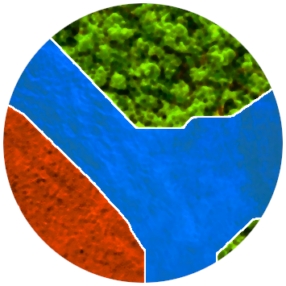

#  Deepness: **Deep** **N**eural r**E**mote **S**en**S**ing QGIS Plugin

[](https://github.com/PUTvision/qgis-plugin-deepness/graphs/contributors)
[](https://github.com/PUTvision/qgis-plugin-deepness/stargazers)
[](https://github.com/PUTvision/qgis-plugin-deepness/network/members)

Plugin for QGIS to perform map/image segmentation with (ONNX) neural network models. 

# Development
 - Install QGIS (the plugin was tested with QGIS 3.12)
   - Debian/Ubuntu based systems: `sudo apt install qgis`
   - Fedora: `sudo dnf install qgis`
   - Arch Linux: `sudo pacman -S qgis`
   - Windows, macOS and others: https://qgis.org/en/site/forusers/download.html
 - Create virtual environment (with global packages inherited!):
```
python3 -m venv venv --system-site-packages
```
 - Create a symlink to our plugin in a QGIS plugin directory:
```
ln -s $PROJECT_DIR/plugin/deepness ~/.local/share/QGIS/QGIS3/profiles/default/python/plugins/deepness
```
 - Activate the environment and install requirements:
```
. venv/bin/activate
pip install -r requirements.txt
```
 - Run QGis in the virtual environment:
```
export IS_DEBUG=true  # to enable some debugging options
qgis
```
 - Enable `Deepness` plugin in the `Plugins -> Manage and install plugins`
 - Install and enable:
   - `Plugin reloader` plugin - allows plugins reloading
   - `first aid` plugin - prints stack traces for exceptions 

After the plugin code is modified, use the `Plugin reloader` to reload our plugin.

# Unit tests
See [test/README.md](test/README.md)

# Documentation
See [docs/README.md](docs/README.md)

# Development notes
 - plugin skeleton was initially generated with `Plugin Builder`, but then refactored and cleaned up a little bit
 - Before release: change version number in `metadata.txt` and in docs (?)
 - to recreate resource file (`resource.qrsc`) run:
    ```
    cd plugin/deepness
    pyrcc5 -o resources.py resources.qrc
    ```
   Though I'm not sure if this file is even needed anymore
 - 
